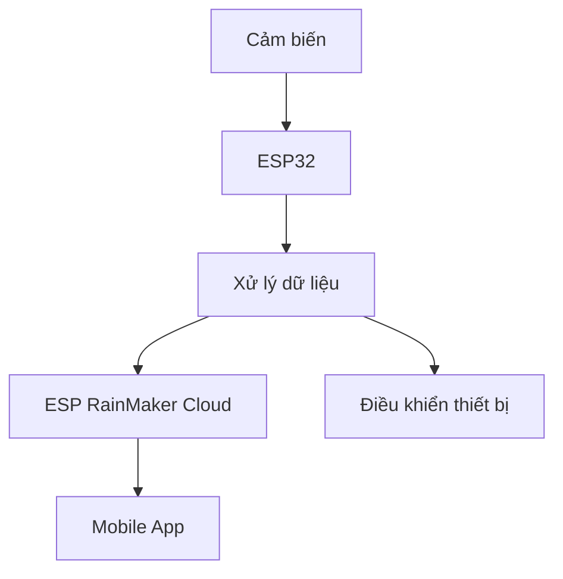

# 🐟 Hệ thống giám sát hồ cá thông minh dùng ESP32

## 📌 Giới thiệu

Dự án xây dựng hệ thống giám sát hồ cá thông minh ứng dụng công nghệ IoT, sử dụng vi điều khiển ESP32 kết hợp các cảm biến môi trường nước và nền tảng ESP RainMaker.

Hệ thống giúp người dùng theo dõi và điều khiển hồ cá từ xa một cách tự động, chính xác và tiện lợi.

---

## 🚀 Tính năng chính

### 🌡️ Giám sát môi trường nước

* Đo **nhiệt độ nước** (DS18B20)
* Đo **độ pH**
* Đo **độ đục (NTU)**
* Đo **mực nước**

---

### ⚙️ Điều khiển tự động

* Tự động **bơm nước** khi cần
* **Xả nước** khi chất lượng không đạt
* Điều khiển **servo (cho ăn)**

---

### 📱 Giám sát & điều khiển từ xa

* Theo dõi dữ liệu realtime trên **ESP RainMaker**
* Hiển thị biểu đồ theo thời gian
* Điều khiển thiết bị từ xa

---

### 🎙️ Điều khiển bằng giọng nói

* Tích hợp **Amazon Alexa**
* Điều khiển thiết bị bằng voice

---

## 🛠️ Công nghệ sử dụng

* 🔹 ESP32
* 🔹 ESP-IDF
* 🔹 ESP RainMaker
* 🔹 WiFi / Bluetooth
* 🔹 Amazon Alexa

---

## 🔌 Phần cứng sử dụng

* ESP32 DevKit
* Cảm biến pH
* Cảm biến độ đục
* Cảm biến nhiệt độ DS18B20
* Cảm biến mực nước không tiếp xúc
* Servo
* Máy bơm mini
* Van điện từ
* MOSFET Driver
* OLED SH1106

---

## 📊 Kiến trúc hệ thống

---

## 📷 Hình ảnh hệ thống

### 🔧 Mô hình phần cứng

*(Theo báo cáo trang 9)*

### 📱 Giao diện ứng dụng

*(Hiển thị trạng thái và biểu đồ dữ liệu)*

---

## ✅ Ưu điểm

* Giao diện app dễ sử dụng
* Theo dõi từ xa tiện lợi
* Dữ liệu cập nhật liên tục
* Tích hợp nhiều cảm biến

---

## ⚠️ Nhược điểm

* Độ chính xác cảm biến chưa cao
* Phụ thuộc kết nối WiFi
* Chưa tối ưu cho môi trường thực tế

---

## 🔮 Hướng phát triển

* Nâng cấp cảm biến công nghiệp
* Xây dựng Web Server riêng
* Cho phép chỉnh ngưỡng trực tiếp trên app
* Mở rộng nhiều hồ cá

---

## 👨‍💻 Thành viên nhóm

* Đặng Văn Linh
* Phạm Văn Cơ
* Đinh Công Vĩnh Cát
* Trần Như Thịnh
* Lê Hữu Phước

